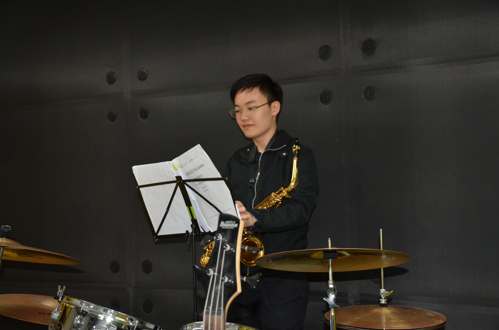

# Ziyang Wang 王梓瑒  

## Background
Master of Applied Econometrics （Monash University）  
Bachelor of Commerce (University of Western Australia)  
Bachelor of Economics (Southwest University 西南大学)  
## CV 简介  
[cv](CV_Ziyang _Wang.pdf)
[简介]（王梓瑒.pdf）
